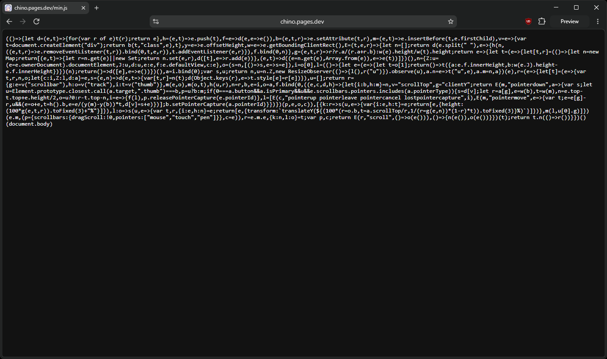
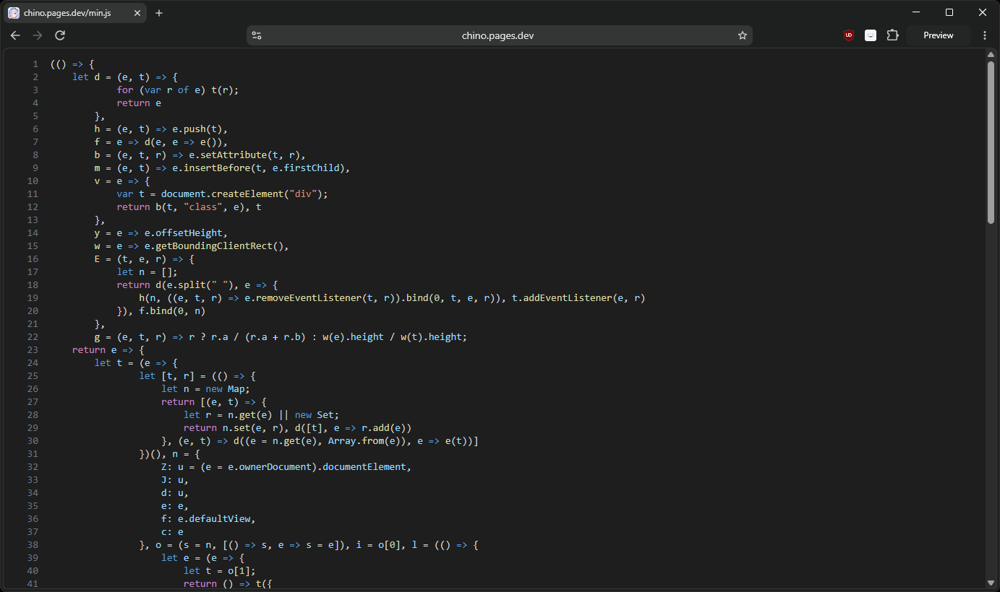

<p align="center">
  
</p>

<p align="center">
  <sub>Highlight (icon) by <a href="https://thenounproject.com/browse/icons/term/highlight/" target="_blank" title="highlight Icons">creacuatro</a> from <a href="https://thenounproject.com/browse/icons/term/highlight/" target="_blank" title="highlight Icons">Noun Project</a> (CC BY 3.0)</sub>
</p>

<h1 align="center">highlight</h1>

<p align="center">
    is a chrome extension to highlight code and beautify HTML, CSS, JS
</p>

<p align="center">
  <a href="https://github.com/ftnick/highlight/blob/main/LICENSE"></a>
  <a href="https://github.com/ftnick/highlight/commits/main"></a>
</p>

> [!NOTE]
> This project is a revamped version of [the original 2024 highlight repo by AutumnVN](https://github.com/AutumnVN/highlight).

> [!WARNING]
> This project is in a very early development state. A lot of features are still unstable, and parts of the project remain outdated from the original repo.

|         Before          |         After         |
| :---------------------: | :-------------------: |
|  |  |

## Installation

1. Clone this repo

```
git clone https://github.com/ftnick/highlight
```

2. Go to `chrome://extensions/`

3. Enable `Developer mode`

4. Click `Load unpacked` and select the cloned folder
